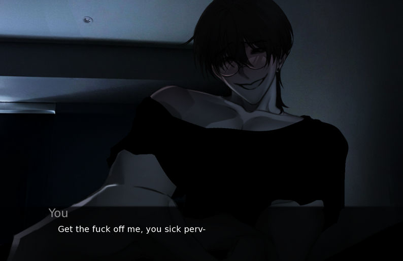
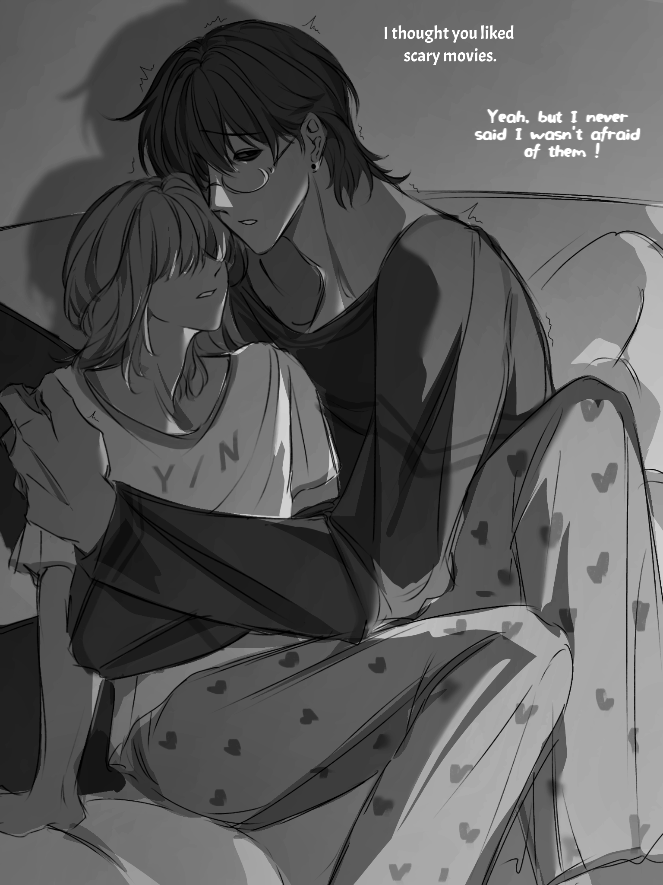

# Play Survive Min Online

Survive Min is a psychological horror visual novel that traps players inside a terrifying night with an unpredictable entity named Min.

The game combines:
- psychological horror
- emotional tension
- branching dialogue choices
- survival interactions
- multiple endings
- yandere horror themes

Many visual novel fans praised the game for its:
- atmospheric storytelling
- expressive character art
- emotionally unstable interactions
- unsettling relationship dynamics
- memorable true ending
- strong horror presentation

---

---

# Story Overview

The story begins with strange noises outside your home.

People around the neighborhood have started disappearing.

Bodies are being discovered nearby.

Then one night, the sounds stop coming from outside.

They begin coming from inside your room.

Min — the entity now trapped inside with you — constantly shifts between affectionate, manipulative, playful, unsettling, and dangerous behavior.

Every interaction feels unstable, and even small choices can completely change how the night ends.

---

# Play Survive Min Online

## Browser Playable Version

https://survivemin.live/

The browser-accessible version allows players to experience the game directly online across desktop and mobile browsers without traditional installation requirements.

Many players originally experienced:
- download issues
- installation limitations
- mobile compatibility problems

The browser version helps more people experience the game more easily online.

---

# Official Game

https://yaniswatching.itch.io/survive-min

---

# Why Players Love The Game

Players frequently praise:
- the emotional tension
- horror atmosphere
- yandere writing
- voice acting
- expressive character reactions
- branching endings
- psychological instability of Min

Many horror VN players described Min as one of the most memorable yandere characters they had experienced in recent years.

---

---

# Browser Version Features

- Browser playable
- Desktop compatible
- Mobile browser compatible
- Psychological horror experience
- Interactive visual novel gameplay
- Story-rich narrative
- Multiple endings
- Atmospheric presentation

---

# Tags

Psychological Horror, Visual Novel, Yandere, Horror VN, Browser Game, Indie Horror, Interactive Fiction, Anime Horror, Story Rich

---

# Disclaimer

All rights belong to the original creators of Survive Min.

This repository exists as a browser-accessibility and fan community project related to the game.
